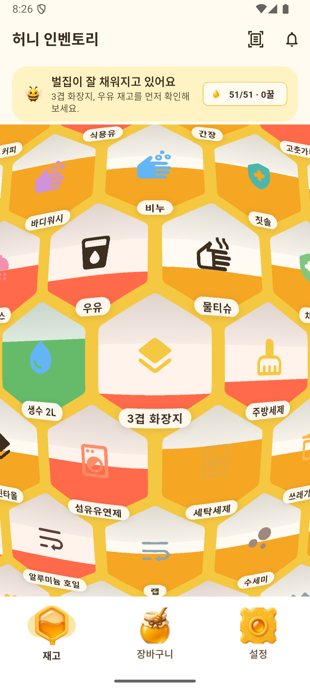
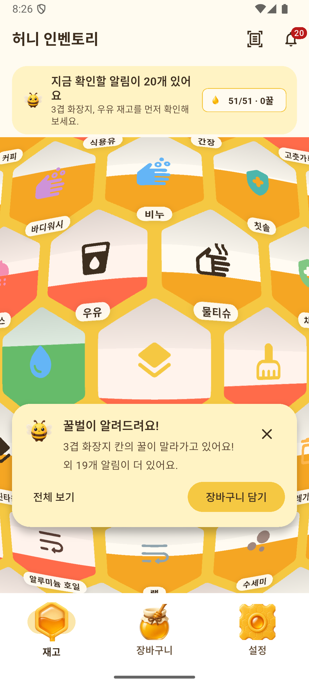
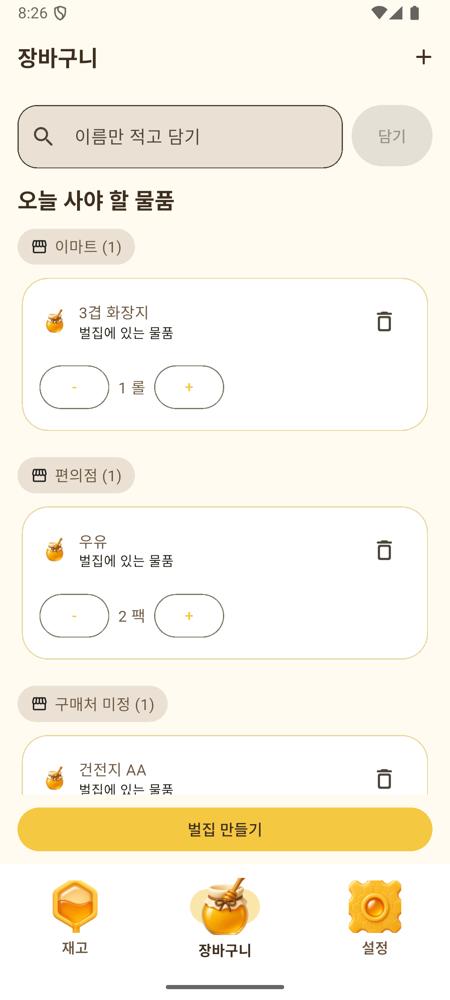
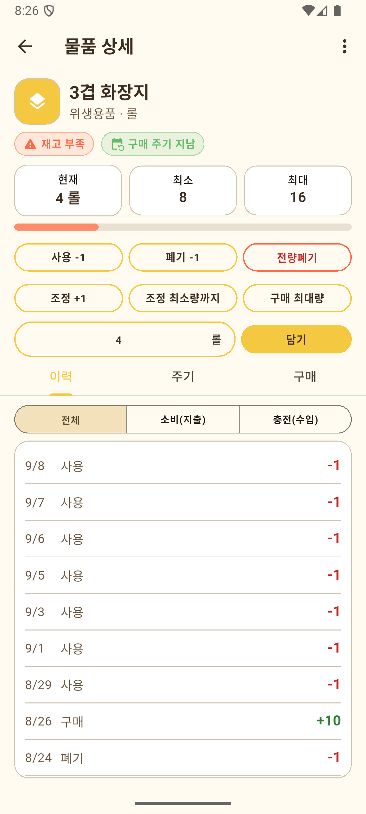
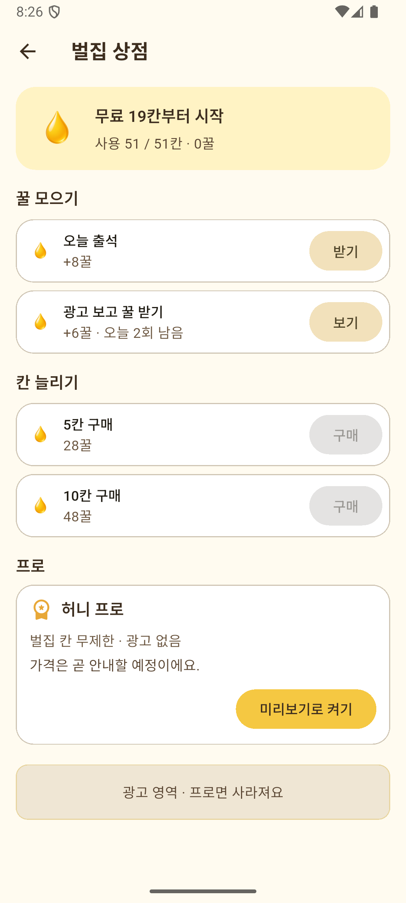
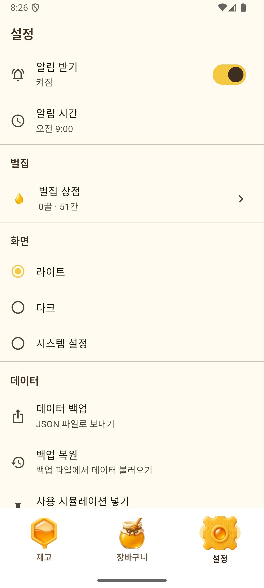
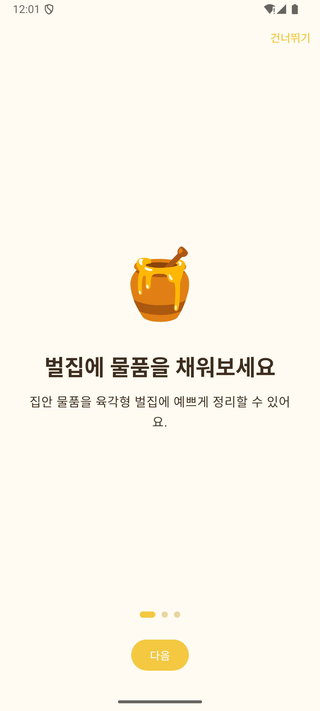

# 🍯 허니 인벤토리 (Honey Inventory)

> 집안 물품 재고를 **육각형 벌집**에 채우고, 다 떨어질 때쯤 **꿀벌이 알려주는** Flutter 홈 인벤토리 앱

휴지·세제·생수처럼 주기적으로 떨어지는 생활용품을 벌집 한 칸씩 관리합니다. 재고가 많을수록 칸에 꿀이 차오르고, 구매 주기가 다가오면 꿀벌이 "웽웽!" 하고 알려줍니다. 살 물건은 꿀단지(장바구니)에 담아 구매처별로 묶어 볼 수 있습니다.

<p align="center">
  
  
  
</p>

## 주요 기능

### 🐝 벌집 재고판
- 물품 하나가 벌집 한 칸입니다. 재고량만큼 꿀이 차오르고, 부족하면 빨갛게 표시됩니다.
- 벌집을 드래그해 둘러보고, 길게 눌러 칸 위치를 옮길 수 있습니다.
- 칸을 누르면 물품 상세로 들어가 재고를 조정합니다(사용·폐기·전량폐기·직접 입력, 이력 기록).
- 정렬: 이름 / 부족한 순 / 최근 사용 / 카테고리

### ⏰ 구매 주기 알림
- 물품별로 일·주·월 단위 구매 주기를 등록합니다.
- 구매 이력이 쌓이면 실제 간격으로 주기를 자동 추정합니다.
- 정해진 시간에 로컬 푸시를 보내고, 앱 안에서는 꿀벌 알림 카드로 보여줍니다(3일 미루기 지원).

### 🏺 꿀단지 (장바구니)
- 벌집에서 바로 담거나 이름만 적어 담을 수 있습니다.
- 최근 구매처별로 그룹을 묶고, 최근 방문순으로 정렬합니다.
- 검색, 일괄 구매 완료, 스와이프 삭제를 지원합니다. 구매를 완료하면 재고가 자동으로 채워집니다.

### 🧾 영수증 스캔 (OCR)
- 카메라나 갤러리로 영수증을 읽어 품목을 인식합니다(Google ML Kit, 기기 내 처리).
- 인식 결과를 수정한 뒤 기존 물품과 합치거나 새 물품으로 등록합니다.

### 🍯 꿀 경제 & 벌집 상점
- 무료로 19칸부터 시작하고, 꿀을 모아 칸을 늘립니다.

  | 꿀 모으기 | 꿀 | 칸 늘리기 | 가격 |
  |---|---|---|---|
  | 오늘 출석 | +8꿀 (하루 1회) | 5칸 | 28꿀 |
  | 광고 보고 받기 | +6꿀 (하루 2회) | 10칸 | 48꿀 |

- 보상형 광고는 AdMob(Android·iOS)으로 붙어 있습니다.

### ⚙️ 그 밖에
- 온보딩 3장, 라이트·다크·시스템 테마
- JSON 백업·복원, 데모용 "사용 시뮬레이션"(생활용품 50여 개 + 가계부 이력)
- 물품 상세에서 재고 변동 이력(사용·폐기·구매)과 구매 기록 확인

<p align="center">
  
  
  
</p>

<p align="center">
  
</p>

> 스크린샷: Android 에뮬레이터(Pixel, API 35), 릴리즈 빌드, 사용 시뮬레이션 데이터

## 기술 스택

| 영역 | 사용 기술 |
|---|---|
| 프레임워크 | Flutter 3.44 / Dart 3.12 |
| 상태 관리 | Riverpod 3 |
| 라우팅 | go_router |
| 로컬 DB | Drift (SQLite) |
| 알림 | flutter_local_notifications, workmanager |
| OCR | google_mlkit_text_recognition |
| 광고 | google_mobile_ads (보상형) |
| 그래픽 | 커스텀 육각형 레이아웃 + 프래그먼트 셰이더(벌집 렌즈 효과) |

서버 없이 모든 데이터를 기기 안에 저장합니다.

## 프로젝트 구조

```
lib/
├── core/          # 테마, 색상, 브랜드 이미지
├── data/          # Drift DB, 리포지토리, 백업·동기화 서비스, 시뮬레이션 데이터
├── domain/        # 엔티티, 구매 주기 추정 등 도메인 로직
├── presentation/  # 화면 (hive, cart, product, receipt, notifications, settings, onboarding)
├── routes/        # go_router 설정
└── services/      # 광고(AdMob) 등 외부 연동
shaders/           # 벌집 렌즈 프래그먼트 셰이더
docs/              # 기획·설계 문서, QA 체크리스트, 스크린샷
```

## 시작하기

```bash
flutter pub get
flutter run
```

- iOS는 CocoaPods가 필요합니다(`cd ios && pod install`). 최소 iOS 15.5.
- 디버그 빌드는 iOS 14+ 정책상 홈 화면 아이콘으로 실행되지 않습니다. 실기기에서 홈으로 열어 보려면 `flutter run --release`로 설치하세요.

### DB 스키마를 바꿨다면

```bash
dart run build_runner build --delete-conflicting-outputs
```

### 테스트

```bash
flutter test
```

벌집 레이아웃, 구매 주기 추정, 영수증 파서, 꿀 경제, 알림 라우팅 등 41개 테스트가 있습니다.

### 실제 광고로 빌드하기

기본값은 Google 테스트 광고입니다. 스토어 배포용 릴리즈 빌드에서만 실제 광고 단위를 씁니다.

```bash
flutter build appbundle --release --dart-define=USE_PRODUCTION_ADS=true
flutter build ipa --release --dart-define=USE_PRODUCTION_ADS=true
```

## 개발 현황

| 범위 | 상태 |
|---|---|
| MVP — 벌집, 물품 등록, 재고 조정, 구매 주기 알림, 장바구니, 로컬 저장 | ✅ 완료 |
| v0.2 — 온보딩, 정렬, 구매처 그룹, 주기 자동 추정, 다크 모드 | ✅ 완료 |
| 영수증 OCR, JSON 백업·복원 | ✅ 완료 |
| 꿀 경제 · 벌집 상점 · 보상형 광고 | ✅ 완료 (Android 실기기 확인) |
| iOS 27 실기기 실행 | ✅ 완료 |
| 허니 프로(유료, 광고 제거) | 🚧 미리보기 UI만 있음 |
| 가족 공유(클라우드 동기화) | 🚧 인터페이스만 있음 |
| 홈 화면 위젯 | ⏳ 미착수 |

## 문서

기획·설계 문서는 [`docs/`](docs/README.md)에 있습니다.

- [프로젝트 개요](docs/01-project-overview.md) · [PRD](docs/02-prd.md) · [UI/UX 가이드](docs/03-ui-ux-design.md)
- [데이터 모델](docs/04-data-model.md) · [기능 명세](docs/05-feature-specs.md) · [기술 아키텍처](docs/06-technical-architecture.md)
- [화면 흐름](docs/07-screen-flow.md) · [테스트 계획](docs/08-test-plan.md) · [스토어 등록 문구](docs/store-listing-ko.md)
